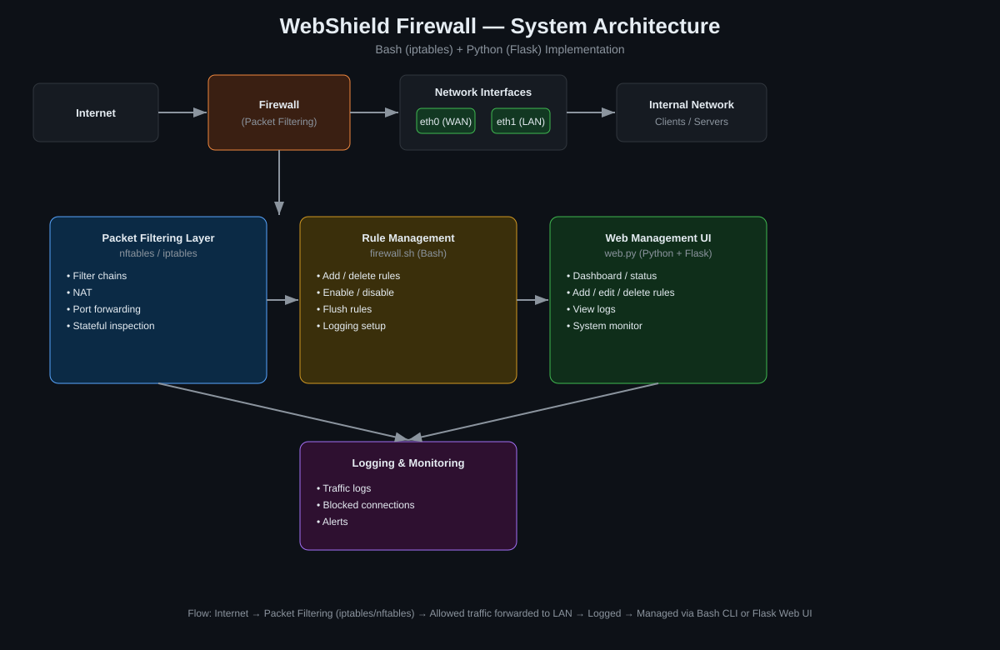

# 🛡️ WebShield Firewall

A custom Linux firewall built with **Bash (iptables/nftables)** for packet
filtering and a **Python (Flask)** web dashboard for management — built and
tested on Kali Linux.


## Overview

WebShield Firewall gives you two ways to control the same underlying
`iptables` ruleset: a scriptable CLI (`firewall.sh`) for automation/SSH use,
and a browser dashboard (`web.py`) for visual monitoring and quick rule
changes. It's designed as a learning/portfolio project that demonstrates
core network security concepts: stateful packet filtering, NAT, port/IP
blocking, and traffic logging.

## Architecture



**Traffic flow:** Internet → Packet Filtering Layer (iptables/nftables) →
allowed traffic forwarded to the internal LAN → all decisions logged →
managed via the Bash CLI or the Flask web UI.

## Features

- **Stateful packet filtering** — default-deny INPUT/FORWARD policy, only
  explicitly allowed traffic passes
- **Port & IP management** — allow/block specific ports or source IPs from
  the CLI or the browser
- **NAT / port forwarding** — LAN clients share the WAN interface via
  MASQUERADE
- **Anti-scan protections** — drops NULL, FIN, and other malformed TCP flag
  scans
- **Logging & monitoring** — rate-limited logging of dropped packets to
  `/var/log/webshield_firewall.log`, viewable in the dashboard
- **Web dashboard** — live status, active rule count, recent traffic, and a
  form to add/remove rules without touching the terminal
- **Rule persistence** — `save`/`restore` commands snapshot rules with
  `iptables-save`/`iptables-restore`

## Screenshots

**Dashboard**


**CLI**


**Active Rules**


**Add Rule**


**Logs**


> These are real captures of the app running in `WEBSHIELD_DEMO=1` mode — see
> [Demo mode](#demo-mode) below.

## Project Structure

```
WebShield_Firewall/
├── README.md
├── LICENSE
├── requirements.txt
├── .gitignore
├── script/
│   ├── firewall.sh        # core iptables engine (CLI)
│   └── web.py              # Flask dashboard
├── config/
│   └── rules.conf          # example saved ruleset
├── docs/
│   ├── network_topology.svg
│   └── screenshots/
└── logs/
    └── .gitkeep
```

## Requirements

- Linux with `iptables` (tested on Kali Linux, kernel 6.6)
- Root/sudo privileges (packet filtering requires `CAP_NET_ADMIN`)
- Python 3.9+
- Flask (`pip install -r requirements.txt`)

## Installation

```bash
git clone https://github.com/<your-username>/WebShield_Firewall.git
cd WebShield_Firewall
chmod +x script/firewall.sh
pip install -r requirements.txt
```

## Usage

### CLI

```bash
sudo ./script/firewall.sh init              # apply default-deny baseline
sudo ./script/firewall.sh status            # show policy + rule count
sudo ./script/firewall.sh allow-port 8080   # allow inbound TCP/8080
sudo ./script/firewall.sh block-ip 203.0.113.45
sudo ./script/firewall.sh list              # show active rules
sudo ./script/firewall.sh save              # persist rules
sudo ./script/firewall.sh flush             # reset everything
```

### Web dashboard

```bash
sudo python3 script/web.py
```

Then open **http://127.0.0.1:5000/dashboard**.

> The Flask process calls `firewall.sh` via `sudo`. For a passwordless setup
> during local testing, add a sudoers rule scoped only to this script:
> `youruser ALL=(root) NOPASSWD: /full/path/to/firewall.sh`

### Demo mode

Set `WEBSHIELD_DEMO=1` to run the dashboard without root or iptables. It
serves realistic sample status/rules/logs instead of shelling out to
`firewall.sh` — useful for showcasing the UI on a portfolio host or generating
documentation screenshots, without giving a public web server control over a
real firewall.

```bash
WEBSHIELD_DEMO=1 python3 script/web.py
```

## Roadmap

- [ ] nftables backend as an alternative to iptables
- [ ] Rule scheduling (time-based allow/block)
- [ ] REST API for the dashboard actions
- [ ] Docker Compose demo environment (no root needed to try the UI)
- [ ] Unit tests for `firewall.sh` using `bats`

## Disclaimer

This project is for educational and portfolio purposes. Test in an isolated
VM/lab before applying to any production or internet-facing host — an
incorrect default-deny policy can lock you out of remote systems.

## License

MIT — see [LICENSE](LICENSE).
